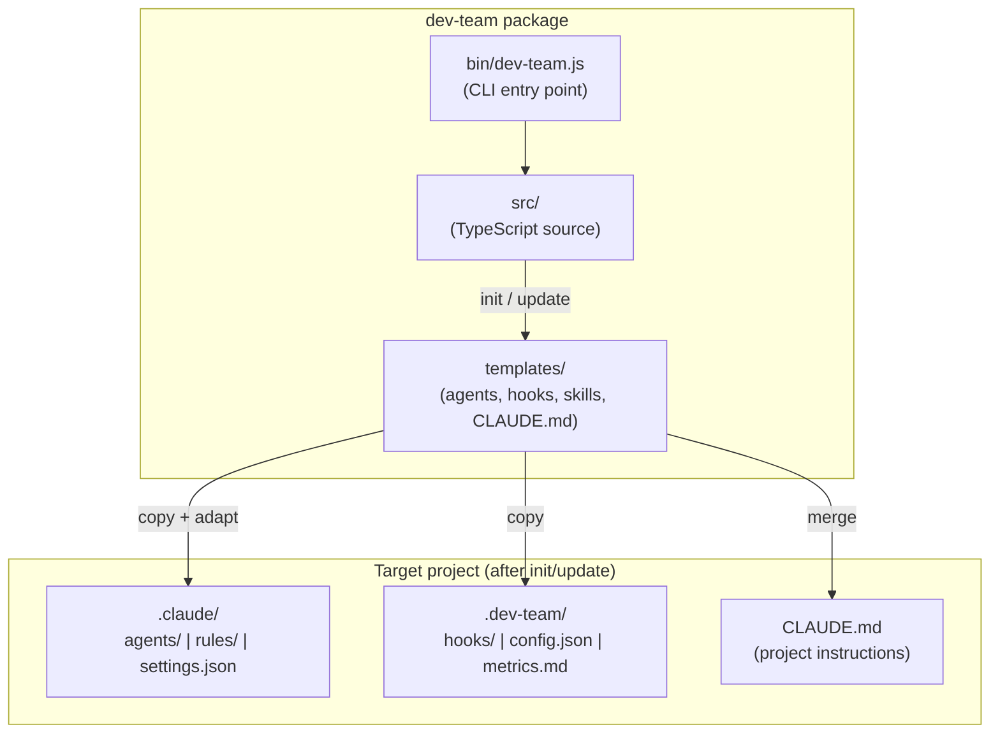
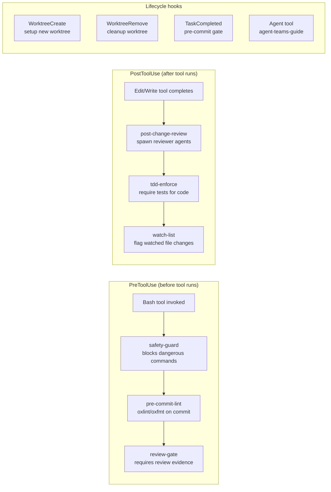
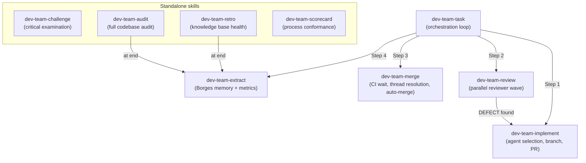
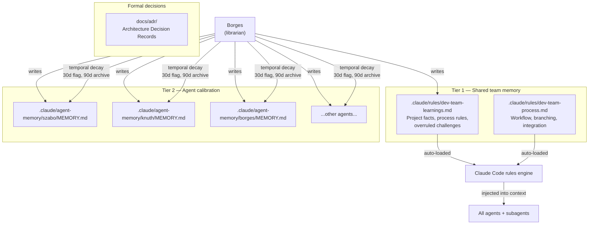
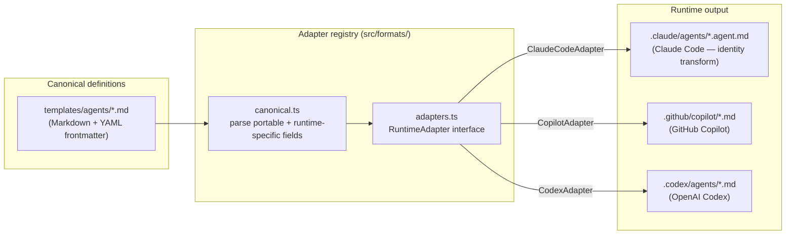

# Architecture

High-level guide to dev-team's architecture. For detailed decisions, see individual [ADRs](docs/adr/).

## System Overview

dev-team is a CLI tool (`npx dev-team init`) that installs adversarial AI agents, hooks, and skills into any project. The installed components enforce quality through productive friction — agents implement, review, and challenge each other's work.



The `init` command copies template files into the target project. The `update` command refreshes framework-managed files (`.dev-team/`) while preserving project-specific customizations (`.claude/hooks/`, `.claude/skills/`, `.claude/rules/`). Settings in `.claude/settings.json` are merged additively — new hooks are added but user entries are never removed.

## Agent Interaction Model

Thirteen agents collaborate through an orchestrated adversarial loop. Drucker (the orchestrator) delegates work to implementing agents, then spawns reviewers who challenge the implementation with classified findings.

```mermaid
graph TB
    Human((Human))

    subgraph "Orchestration"
        Drucker["Drucker<br/>(orchestrator)"]
    end

    subgraph "Research"
        Turing["Turing<br/>(researcher)"]
    end

    subgraph "Implementing agents"
        Voss["Voss<br/>(backend)"]
        Hamilton["Hamilton<br/>(infrastructure)"]
        Mori["Mori<br/>(frontend)"]
        Deming["Deming<br/>(tooling)"]
        Tufte["Tufte<br/>(documentation)"]
        Conway["Conway<br/>(release)"]
    end

    subgraph "Reviewing agents"
        Szabo["Szabo<br/>(security)"]
        Knuth["Knuth<br/>(correctness)"]
        Brooks["Brooks<br/>(architecture)"]
        Rams["Rams<br/>(design system)"]
    end

    subgraph "Memory"
        Borges["Borges<br/>(librarian)"]
    end

    Human -->|"task"| Drucker
    Drucker -->|"research brief<br/>(sequential, pre-implementation)"| Turing
    Turing -->|"findings"| Drucker
    Drucker -->|"pre-assessment"| Brooks
    Brooks -->|"ADR needed? complexity?"| Drucker
    Drucker -->|"delegate"| Voss & Hamilton & Mori & Deming & Tufte & Conway

    Voss & Hamilton & Mori & Deming & Tufte & Conway -->|"implementation"| Drucker
    Drucker -->|"review wave<br/>(parallel)"| Szabo & Knuth & Brooks & Rams

    Szabo & Knuth & Brooks & Rams -->|"classified findings"| Drucker
    Drucker -->|"DEFECT → fix"| Voss & Hamilton & Mori & Deming & Tufte & Conway
    Drucker -->|"advisory"| Human
    Drucker -->|"extract"| Borges
    Borges -->|"memory updates"| Drucker
    Drucker -->|"summary"| Human
```



### Finding classification

Reviewers classify findings to separate blocking issues from advisory feedback:

| Classification | Effect |
|---|---|
| `[DEFECT]` | Blocks progress — must be fixed before merge |
| `[RISK]` | Advisory — potential issue, reported to human |
| `[QUESTION]` | Advisory — needs clarification |
| `[SUGGESTION]` | Advisory — improvement idea |

When agents disagree, each side gets one exchange. If unresolved, the human decides. Drucker runs a judge filtering pass to remove contradictions with existing ADRs, deduplicate across reviewers, and validate that DEFECTs include concrete reproduction scenarios.

## Hook Execution Flow

Hooks fire automatically during Claude Code tool use. They are wired in `.claude/settings.json` and execute JavaScript scripts from `.dev-team/hooks/`.



**PreToolUse hooks** intercept tool calls before execution. The safety guard blocks destructive commands (`rm -rf`, `git push --force`). The review gate blocks commits that lack review evidence — enforcing the adversarial loop at commit time (ADR-029).

**PostToolUse hooks** fire after file changes. The post-change-review hook matches changed files against patterns in `agent-patterns.json` and emits `ACTION REQUIRED` directives to spawn the appropriate reviewer agents. The watch-list hook flags changes to sensitive files.

**Lifecycle hooks** handle worktree creation/removal for parallel agent isolation and the pre-commit gate for memory update verification.

## Skill Composition

Skills are user-invocable workflows defined in Markdown (`SKILL.md`). Orchestration skills compose other skills via the `--embedded` flag, which produces compact output suitable for skill-to-skill invocation (ADR-035).



The task skill implements a four-step model per branch: **Implement** (agent works on branch, creates PR) **-> Review** (adversarial review, defect routing loop) **-> Merge** (CI verification, thread resolution) **-> Extract** (Borges memory extraction). Review intensity adapts to complexity — SIMPLE tasks get LIGHT (advisory-only) reviews, COMPLEX tasks get FULL (blocking DEFECT) reviews.

## Memory Architecture

Two-tier memory system ensures learnings are shared across all agents and sessions while allowing per-agent calibration.



| Tier | Location | Scope | Loaded by |
|---|---|---|---|
| Tier 1 | `.claude/rules/` | All agents, all sessions | Claude Code rules engine (automatic) |
| Tier 2 | `.claude/agent-memory/<agent>/` | Per-agent calibration | Each agent at session start |
| ADRs | `docs/adr/` | Formal decisions | Agents when reviewing related areas |
| Machine-local | `~/.claude/projects/` | User-specific preferences only | Claude Code (automatic) |

Borges runs at the end of every workflow (`dev-team-extract`). It evaluates memory freshness via `Last-verified` dates, merges duplicates, supersedes contradictions, and generates calibration rules when 3+ findings on the same tag are overruled.

## File Layout

```
dev-team/
├── bin/                          # CLI entry point
│   └── dev-team.js
├── src/                          # TypeScript source → dist/
│   ├── formats/
│   │   ├── canonical.ts          # Canonical agent definition schema
│   │   └── adapters.ts           # Multi-runtime adapter registry
│   └── ...
├── templates/                    # Shipped to target projects
│   ├── agents/                   # 13 agent definitions (.md)
│   │   └── SHARED.md             # Shared protocol (all agents)
│   ├── hooks/                    # Hook scripts (.js)
│   │   ├── dev-team-safety-guard.js
│   │   ├── dev-team-review-gate.js
│   │   ├── dev-team-tdd-enforce.js
│   │   └── ...
│   ├── skills/                   # Skill definitions
│   │   ├── dev-team-task/
│   │   ├── dev-team-implement/
│   │   ├── dev-team-review/
│   │   ├── dev-team-merge/
│   │   ├── dev-team-extract/
│   │   └── ...
│   ├── settings.json             # Hook wiring template
│   └── CLAUDE.md                 # CLAUDE.md template
├── docs/adr/                     # Architecture Decision Records
├── tests/                        # Unit, integration, scenario tests
│
│── (Target project after install) ──
├── .claude/                      # Project-specific (preserved on update)
│   ├── agents/                   # Installed agent definitions
│   ├── rules/                    # Auto-loaded by all agents
│   │   ├── dev-team-learnings.md # Tier 1 shared memory
│   │   └── dev-team-process.md   # Workflow configuration
│   ├── agent-memory/             # Tier 2 per-agent calibration
│   ├── hooks/                    # User's custom hooks
│   ├── skills/                   # User's custom skills
│   └── settings.json             # Merged hook wiring
├── .dev-team/                    # Framework-managed (overwritten on update)
│   ├── hooks/                    # Framework hook scripts
│   ├── config.json               # Feature flags
│   └── metrics.md                # Delivery metrics (preserved)
└── CLAUDE.md                     # Project instructions
```

## Multi-runtime Adapter Flow

dev-team defines agents in a canonical Markdown+YAML format. Runtime adapters translate this into each platform's native configuration (ADR-036).



The canonical schema separates **portable fields** (name, description, instruction body) from **runtime-specific fields** (tools, model, memory). The Claude Code adapter is an identity transform — the canonical format is the Claude Code format. Other adapters map portable fields to their runtime's conventions and ignore unsupported runtime-specific fields. Select runtimes during init with `--runtime claude,copilot`.
