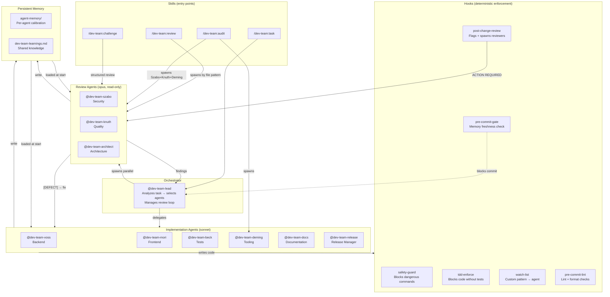

# dev-team

Adversarial AI agent team for any project. Installs [Claude Code](https://claude.ai/claude-code) agents, hooks, and skills that enforce quality through productive friction.

Instead of an AI that agrees with everything, dev-team gives you ten opinionated specialists that challenge each other — and you. Hooks enforce the process deterministically. Agents can't skip reviews. Commits are blocked until the team signs off.

## How the system works



### The flow

1. **You give a task** → `@dev-team-lead` or `/dev-team:task`
2. **Lead delegates** → picks the right implementer (Voss for backend, Mori for frontend, etc.)
3. **Implementer writes code** → hooks fire automatically on every edit
4. **Hooks flag reviewers** → `ACTION REQUIRED` directive + tracking file written
5. **Reviewers spawn in parallel** → produce classified findings (`[DEFECT]`, `[RISK]`, etc.)
6. **`[DEFECT]` found** → goes back to implementer for fixing
7. **No defects remain** → tracking file cleared → commit allowed
8. **Memory updated** → learnings persisted for next session

The key: **hooks make this mandatory**. The pre-commit gate blocks if flagged reviewers weren't spawned. Agents can't be skipped.

## Install

```bash
npx @fredericboyer/dev-team init                    # Interactive wizard
npx @fredericboyer/dev-team init --all              # Everything, no prompts
npx @fredericboyer/dev-team init --preset backend   # Backend-heavy bundle
npx @fredericboyer/dev-team init --preset fullstack  # All agents
npx @fredericboyer/dev-team init --preset data       # Data pipeline bundle
```

Requires Node.js 18+ and Claude Code.

### After installation

```bash
npx @fredericboyer/dev-team update                  # Upgrade to latest templates
npx @fredericboyer/dev-team create-agent <name>     # Scaffold a custom agent
```

## What you get

### Agents (10)

| Agent | Role | Model | When to use |
|-------|------|-------|-------------|
| `@dev-team-lead` | **Orchestrator** | opus | Auto-delegates to specialists, manages review loops |
| `@dev-team-voss` | Backend Engineer | sonnet | API design, data modeling, system architecture |
| `@dev-team-mori` | Frontend Engineer | sonnet | Components, accessibility, UX patterns |
| `@dev-team-szabo` | Security Auditor | opus | Vulnerability review, auth flows, attack surfaces |
| `@dev-team-knuth` | Quality Auditor | opus | Coverage gaps, boundary conditions, correctness |
| `@dev-team-beck` | Test Implementer | sonnet | Writing tests, TDD cycles |
| `@dev-team-deming` | Tooling Optimizer | sonnet | Linters, formatters, CI/CD, hooks, automation |
| `@dev-team-docs` | Documentation Engineer | sonnet | Doc accuracy, stale docs, doc-code sync |
| `@dev-team-architect` | Architect | opus | Coupling, dependency direction, ADR compliance |
| `@dev-team-release` | Release Manager | sonnet | Versioning, changelog, semver validation |

**Opus** agents do deep analysis — Szabo, Knuth, and Architect are read-only reviewers; Lead uses opus for orchestration with full access. **Sonnet** agents implement (faster, full write access).

### Hooks (6)

| Hook | Trigger | Behavior |
|------|---------|----------|
| Safety guard | Before Bash | **Blocks** dangerous commands (`rm -rf /`, force push, `DROP TABLE`, `curl\|sh`). Fails closed on malformed input. |
| TDD enforcement | After Edit/Write | **Blocks** implementation changes without corresponding test files. |
| Post-change review | After Edit/Write | **Flags + tracks** domain agents for review. Writes tracking file. Outputs `ACTION REQUIRED` directive. |
| Pre-commit gate | On task completion | **Blocks** commit if flagged agents were not spawned. Advisory for memory freshness. |
| Watch list | After Edit/Write | **Flags** custom agents based on configurable file-pattern-to-agent mappings in `dev-team.json`. |
| Task loop | On stop | Manages iteration counting for `/dev-team:task` adversarial review loop. |

All hooks are Node.js scripts — work on macOS, Linux, and Windows.

### Skills (4)

| Skill | What it does |
|-------|-------------|
| `/dev-team:task` | Iterative task loop — implement, review, fix defects, repeat until clean |
| `/dev-team:review` | Parallel multi-agent review — spawns agents based on changed file patterns |
| `/dev-team:audit` | Full codebase scan — Szabo (security) + Knuth (quality) + Deming (tooling) |
| `/dev-team:challenge` | Critical examination of a proposal or design decision |

## Step-by-step usage guide

### 1. Start a task

```
@dev-team-lead Add rate limiting to the API endpoints
```

Or use the task loop for automatic iteration:

```
/dev-team:task Add rate limiting to the API endpoints
```

Lead analyzes the task, picks Voss (backend), and spawns Szabo + Knuth as reviewers.

### 2. Let the agents work

The implementing agent explores the codebase, writes code, and writes tests. Hooks fire on every edit:

- **TDD hook** ensures tests exist before implementation
- **Post-change-review** flags reviewers and writes a tracking file
- The LLM **spawns flagged agents as background reviewers** (mandatory, not optional)

### 3. Review cycle

Reviewers produce classified findings:

```
[DEFECT] @dev-team-szabo — src/api/rate-limit.ts:42
  Rate limit key uses client IP, but behind a load balancer req.ip
  returns the LB address. All clients share one rate limit bucket.

[RISK] @dev-team-knuth — tests/rate-limit.test.ts
  Tests mock the Redis client. No integration test verifies actual
  TTL expiry behavior.

[SUGGESTION] @dev-team-knuth — src/api/rate-limit.ts:15
  Extract rate limit config to environment variables for per-env tuning.
```

`[DEFECT]` goes back for fixing. `[RISK]` and `[SUGGESTION]` are reported to you.

### 4. Commit

Once all defects are resolved:
- Tracking file is deleted
- Pre-commit gate allows the commit
- Memory files are updated with learnings

If you try to commit with pending reviews, the pre-commit gate **blocks**:

```
[dev-team pre-commit] BLOCKED — these agents were flagged but not spawned:
  → @dev-team-szabo
  → @dev-team-knuth
```

### 5. Other workflows

**Review a PR or branch:**
```
/dev-team:review
```

**Audit the whole codebase:**
```
/dev-team:audit src/
```

**Challenge a design before building it:**
```
/dev-team:challenge Should we use JWT or session tokens for auth?
```

## Challenge protocol

Every agent uses the same classification:

- **`[DEFECT]`** — Concretely wrong. Will produce incorrect behavior. **Blocks progress.**
- **`[RISK]`** — Not wrong today, but creates a likely failure mode. Advisory.
- **`[QUESTION]`** — Decision needs justification. Advisory.
- **`[SUGGESTION]`** — Works, but here is a specific improvement. Advisory.

Rules:
1. Every finding must include concrete evidence (file, line, input, scenario)
2. Only `[DEFECT]` blocks — everything else is advisory
3. When agents disagree: one exchange each, then escalate to the human
4. Human decides all disputes

## Agent memory

Each agent maintains persistent memory that calibrates over time:

```
.dev-team/
  agent-memory/
    dev-team-voss/MEMORY.md     # Voss's project-specific patterns
    dev-team-szabo/MEMORY.md    # Szabo's security findings
    dev-team-knuth/MEMORY.md    # Knuth's coverage observations
    ...
  learnings.md                  # Shared team knowledge
```

Memory is loaded at session start (first 200 lines). Agents write learnings after each task. The pre-commit gate reminds you to update memory if code changed but learnings didn't.

## Customization

### Edit agents

Agent definitions live in `.dev-team/agents/`. Edit focus areas, challenge style, or philosophy to match your project.

### Create custom agents

```bash
npx @fredericboyer/dev-team create-agent codd    # Scaffold a new agent
```

See [docs/custom-agents.md](docs/custom-agents.md) for the full authoring guide with format reference, blank template, and a worked example.

### Configure watch lists

Add file-pattern-to-agent mappings in `.dev-team/config.json`:

```json
{
  "watchLists": [
    { "pattern": "src/db/", "agents": ["dev-team-codd"], "reason": "database code changed" },
    { "pattern": "\\.graphql$", "agents": ["dev-team-mori"], "reason": "API schema changed" }
  ]
}
```

### Preset bundles

| Preset | Agents included |
|--------|----------------|
| `backend` | Voss, Szabo, Knuth, Beck, Deming, Architect, Release |
| `fullstack` | All 10 agents |
| `data` | Voss, Szabo, Knuth, Beck, Deming, Docs |

`@dev-team-lead` is included in `fullstack` only. For other presets, invoke Lead manually with `@dev-team-lead` when you want automatic delegation.

### Update

```bash
npx @fredericboyer/dev-team update
```

Updates agents, hooks, and skills to the latest templates. Preserves your agent memory, shared learnings, and CLAUDE.md content outside dev-team markers.

## What gets installed

```
.dev-team/
  agents/              # 12 agent definitions (YAML frontmatter + prompt)
  hooks/               # 6 quality enforcement scripts
  skills/              # 4 skill definitions
  agent-memory/        # Per-agent persistent memory (never overwritten on update)
  learnings.md         # Shared team knowledge (never overwritten on update)
  config.json          # Installation preferences
.claude/
  settings.json        # Hook configuration (merged additively, stays in .claude/)
CLAUDE.md              # Project instructions (dev-team section via markers)
```

## Contributing

1. Every piece of work starts with a [GitHub Issue](https://github.com/fredericboyer/dev-team/issues)
2. Branch naming: `feat/123-description` or `fix/456-description`
3. Commits reference issues: `fixes #123` or `refs #123`
4. All merges via PR — no direct pushes to main
5. Run `npm test` before pushing

### Development

```bash
npm install          # Install dependencies (dev only, zero runtime deps)
npm run build        # Compile TypeScript
npm test             # Build + run all tests
npm run lint         # Run oxlint (0 warnings target)
npm run format       # Run oxfmt
```

Architecture decisions are documented in `docs/adr/`.

## License

MIT
